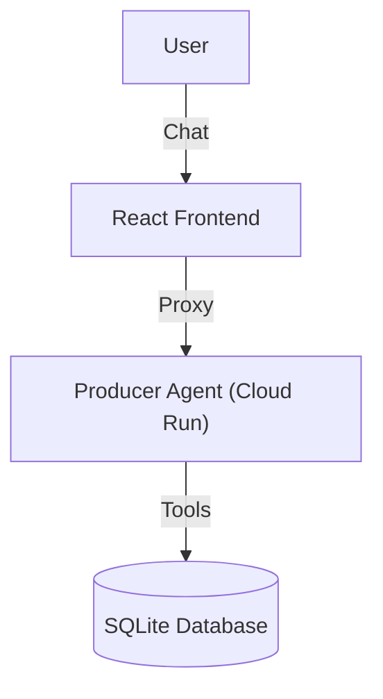

# Purchase Bot Agent 🤖

A robust, agentic procurement assistant designed to manage inventory and purchase orders through natural language conversations. This solution features a Python-based backend agent and a modern React frontend.

## 🌟 Features

-   **Natural Language Inventory Management**: Ask about stock levels, reorder points, and low stock items.
-   **Smart Reordering**: Get automated recommendations for restocking based on predefined policies.
-   **Human-in-the-Loop Procurement**: Create Purchase Orders (POs) with a secure, 2-step approval process.
-   **Full Visibility**: Track open, received, and past orders with ease.
-   **Interactive UI**: The agent emits structured events to render rich tables and dashboards in the chat interface.

## 🏗 Architecture

The system consists of two main components:

1.  **Backend (ProducerAgent)**: Python-based agent (Google ADK) managing inventory logic and SQLite database.
2.  **Frontend**: React application (Vite + TailwindCSS) serving as the chat interface.
    *   *Note*: The frontend includes authentication and SDK features.

## 🚀 Getting Started

### Prerequisites
-   Node.js 18+
-   Python 3.11+
-   Docker (for containerization)

### Frontend Setup
1.  `cd frontend`
2.  `npm install`
3.  `npm run dev`

## 💬 Conversation Flows (Logical Examples)

Here are the tested flows to interact with the bot effectively.

### 1. Identify Low Stock 📉
**Goal**: Find out what needs reordering.

> **User**: "What is low?"
>
> **Bot**: "Here are the items currently below their reorder point:"
> (Displays a table of low stock items, e.g., 'Coffee Beans', 'Paper Cups')
> "Do you want reorder recommendations?"

### 2. Get Recommendations 💡
**Goal**: See what the agent suggests ordering based on policy.

> **User**: "Recommend orders"
>
> **Bot**: "Based on your inventory levels, I recommend ordering:"
> (Displays calculated quantities: Target - On Hand)
> "Shall I draft an order for these?"

### 3. Create a Purchase Order (2-Step Safety) 📝
**Goal**: Place an order safely.

> **User**: "Order coffee and sugar"
>
> **Bot**: "I have prepared a **Draft Order** for 'Acme Supplies':
> - Coffee Beans: 50 units
> - Sugar: 20 units
>
> **Approve this purchase order? (yes/no)**"

> **User**: "Yes"
>
> **Bot**: "✅ Purchase Order **#32** created successfully! Expected delivery: 3 days."

### 4. Receive Inventory 📦
**Goal**: Mark an order as arrived and update stock.

> **User**: "We received PO 32"
>
> **Bot**: "Received Purchase Order #32.
> Inventory updated:
> - Coffee Beans: +50
> - Sugar: +20"

## 🛠 Technology Stack

-   **Frontend**: React, Vite, TailwindCSS
-   **Backend**: Python, Google ADK
-   **Infrastructure**: Docker, Nginx, Google Cloud Run
